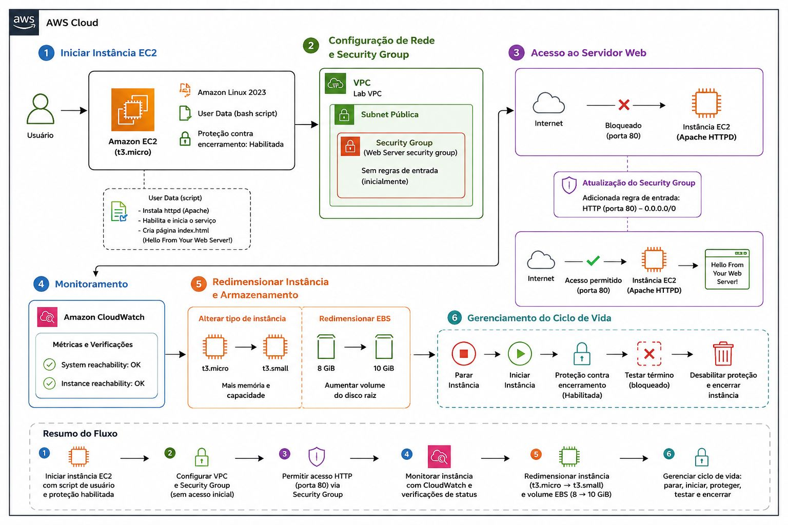
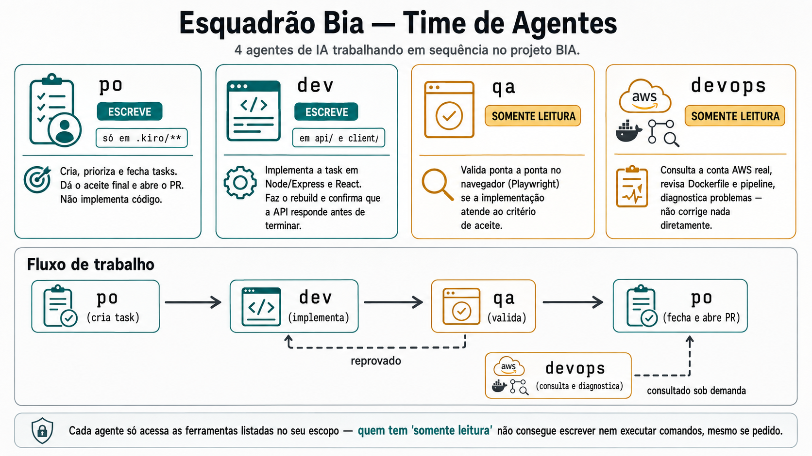

# 🤖 BIA - Backend de Integração AWS

<div align="center">

### Período do evento: 19/09 e 20/09/2026 (Online e ao Vivo das 9h30 às 17h30)


**Projeto-base do módulo Agentes de IA e Multi-Agentes da Formação AWS**

[🚀 Começar](#-início-rápido) •
[📖 Documentação](#-documentação) •
[🏗️ Arquitetura](#️-arquitetura) •
[🤖 Multi-Agentes](#-sistema-multi-agentes)

</div>

---

## 📋 Sobre o Projeto

BIA (Backend de Integração AWS) é uma aplicação full-stack desenvolvida para ensinar conceitos de DevOps, Cloud AWS e desenvolvimento colaborativo utilizando **agentes de IA** (kiro-cli/Claude).

### ✨ Destaques

- 🎯 **Projeto educacional** focado em simplicidade e aprendizado
- 🤖 **Time de agentes de IA** trabalhando em conjunto (PO, Dev, DevOps, QA)
- ☁️ **Infraestrutura AWS** moderna (ECS, RDS, EC2, CodePipeline)
- 🔄 **Git Worktrees** para desenvolvimento isolado e paralelo
- 🧪 **Testes automatizados** com Jest e Playwright
- 📦 **CI/CD** completo com CodePipeline e CodeBuild

---

## 🛠️ Stack Tecnológica

### Backend
- **Runtime:** Node.js 18+
- **Framework:** Express 4.17
- **ORM:** Sequelize 6.6
- **Database:** PostgreSQL (RDS)
- **Auth:** AWS SDK (STS, Secrets Manager)

### Frontend
- **Framework:** React 18.3
- **Build Tool:** Vite 7.3
- **UI:** Tailwind CSS 4.3
- **Routing:** React Router DOM 7.18
- **Icons:** Lucide React, React Icons
- **Charts:** Recharts 3.10

### Cloud & DevOps
- **Container:** Docker + Docker Compose
- **Orchestration:** Amazon ECS (EC2 Launch Type)
- **CI/CD:** CodePipeline + CodeBuild
- **Registry:** Amazon ECR
- **Database:** Amazon RDS (PostgreSQL)
- **Networking:** VPC, Security Groups, ALB
- **Monitoring:** CloudWatch Logs

---

## 🚀 Início Rápido

### Pré-requisitos

```bash
# Node.js 18+
node --version

# Docker & Docker Compose
docker --version
docker compose version

# AWS CLI (para deploy)
aws --version

# Git
git --version
```

### Instalação Local

```bash
# 1. Clone o repositório
git clone https://github.com/henrylle/bia.git
cd bia

# 2. Instale as dependências do backend
npm install

# 3. Instale as dependências do frontend
cd client
npm install
cd ..

# 4. Configure as variáveis de ambiente
cp client/.env client/.env.local
# Edite client/.env.local com suas configurações

# 5. Suba a aplicação com Docker Compose
docker compose up --build

# A aplicação estará disponível em:
# - Backend: http://localhost:8080
# - Frontend: http://localhost:5173
# - Health Check: http://localhost:8080/api/versao
```

### Scripts Disponíveis

```bash
# Backend
npm start          # Inicia o servidor
npm test           # Executa testes unitários
npm run start_db   # Configura o banco de dados

# Frontend (dentro de /client)
npm run dev        # Servidor de desenvolvimento
npm run build      # Build de produção
npm run preview    # Preview do build
```

---

## 📖 Documentação

### 📚 Guias Principais

| Documento | Descrição |
|-----------|-----------|
| [📐 Panorama Geral](docs/panorama-agentes-e-worktrees.md) | Visão completa do projeto e time de agentes |
| [🔄 Worktree Workflow](.kiro/docs/worktree-workflow.md) | Como trabalhar com Git Worktrees |
| [🤖 Multi-Agentes](docs/bia_multi_agentic.png) | Arquitetura do sistema multi-agentes |
| [🏗️ Arquitetura AWS](docs/arquitetura_projeto_bia.jpg) | Infraestrutura na nuvem |

### 📂 Documentação Detalhada

- **Desenvolvimento:**
  - [Roteiro Prático Claude Code](docs/roteiro-pratico-agentes-claude-code.md)
  - [Migração para Claude Code](docs/migrar-time-agentes-para-claude-code.md)
  - [Comparação Kiro CLI vs Claude Code](docs/paralelo-kiro-cli-vs-claude-code.md)

- **DevOps & Infraestrutura:**
  - [Tutorial Túnel SSM](docs/dia-4-porteiro-tunel-ssm-tutorial.md)
  - [Orientações Porteiro RDS](docs/desafio-4-porteiro-rds-orientacao.md)
  - [Integração Completa](docs/dia-3-integracao-completa-explicada.md)
  - [Análise de Arquitetura](docs/analise-arquitetura-projeto.md)

- **Desafios:**
  - [Desafios DevOps](desafios-devops/README.md)
  - [PDF Labs Agents](docs/desafio_labs_agents.pdf)

---

## 🏗️ Arquitetura

### Diagrama de Infraestrutura

<div align="center">
  
</div>

### Componentes AWS

```
┌─────────────────────────────────────────────────────────────┐
│                        GitHub Repository                      │
└───────────────────────┬─────────────────────────────────────┘
                        │
                        ▼
┌─────────────────────────────────────────────────────────────┐
│                      CodePipeline                            │
│  ┌──────────────┐  ┌──────────────┐  ┌──────────────┐      │
│  │   Source     │→ │    Build     │→ │    Deploy    │      │
│  │  (GitHub)    │  │ (CodeBuild)  │  │    (ECS)     │      │
│  └──────────────┘  └──────────────┘  └──────────────┘      │
└─────────────────────────┬─────────────────────────────────────┘
                          │
                          ▼
                  ┌───────────────┐
                  │      ECR       │
                  │ (Docker Images)│
                  └───────┬───────┘
                          │
                          ▼
        ┌─────────────────────────────────────┐
        │         ECS Cluster (EC2)           │
        │  ┌─────────────────────────────┐   │
        │  │    Application Load         │   │
        │  │      Balancer (ALB)         │   │
        │  └──────────┬──────────────────┘   │
        │             ▼                       │
        │  ┌─────────────────────────────┐   │
        │  │      ECS Service             │   │
        │  │  (Tasks running on EC2)      │   │
        │  └──────────┬──────────────────┘   │
        └─────────────┼───────────────────────┘
                      │
                      ▼
            ┌──────────────────┐
            │   RDS PostgreSQL │
            │    (t3.micro)    │
            └──────────────────┘
```

### Nomenclatura de Recursos

| Recurso | Nome | Descrição |
|---------|------|-----------|
| **Cluster** | `cluster-bia-alb` | Cluster ECS com ALB |
| **Task Definition** | `task-def-bia-alb` | Definição de tarefa |
| **Service** | `service-bia-alb` | Serviço ECS |
| **Security Groups** | `bia-db`, `bia-alb`, `bia-ec2` | Grupos de segurança |

---

## 🤖 Sistema Multi-Agentes

O projeto BIA utiliza um **time de agentes de IA** (kiro-cli) que trabalham colaborativamente no desenvolvimento:

<div align="center">
  
</div>

### 👥 Agentes do Time

| Agente | Papel | Implementa Código? | Ferramentas |
|--------|-------|-------------------|-------------|
| **🎯 PO** | Product Owner | ❌ Não | Git/GitHub CLI |
| **💻 Dev** | Full-stack Developer | ✅ Sim | shadcn, npm, docker |
| **☁️ DevOps** | Infra AWS Specialist | ❌ Consultor | aws-mcp (read-only) |
| **🧪 QA** | Quality Assurance | ❌ Tester | Playwright |

### 🔄 Fluxo de Trabalho

```
1. PO cria task → .kiro/tasks/XXX-tipo-resumo.md
                     ↓
2. Agent pega task → move para doing/
                     ↓
3. Cria worktree → .kiro/worktrees/XXX-tipo-resumo/
                     ↓
4. Implementa → commits no branch feature/XXX-...
                     ↓
5. Notifica PO → revisão + PR para ia-main
                     ↓
6. PR mergeado → task para done/ + worktree removido
```

### 📋 Estrutura de Tasks

```
.kiro/
├── tasks/
│   ├── sequencial.md              # Controle de numeração
│   ├── doing/                     # Tasks em andamento
│   │   └── 001-feat-login.md
│   └── done/                      # Tasks concluídas
│       └── 000-feat-inicial.md
├── worktrees/                     # Worktrees isolados (gitignored)
│   └── 001-feat-login/            # Workspace da task 001
├── agents/                        # Configuração dos agentes
│   ├── po/
│   ├── dev/
│   ├── devops/
│   └── qa/
├── rules/                         # Regras compartilhadas
│   ├── infraestrutura.md
│   ├── dockerfile.md
│   └── pipeline.md
└── docs/                          # Documentação técnica
```

---

## 🔐 Segurança e Compliance

### Security Groups

#### Sem ALB (Configuração Inicial)
- **bia-db:** PostgreSQL (porta 5432)
  - Acesso: `bia-web`, `bia-dev`
- **bia-web:** Aplicação web
  - Acesso: público (80/443)

#### Com ALB (Configuração Avançada)
- **bia-db:** PostgreSQL (porta 5432)
  - Acesso: `bia-ec2`, `bia-dev`
- **bia-alb:** Load Balancer
  - Acesso: público (80/443)
- **bia-ec2:** Instâncias ECS
  - Acesso: `bia-alb` (all TCP - portas dinâmicas)

### Boas Práticas

- ✅ Princípio do menor privilégio
- ✅ Security Groups referenciam outros SGs
- ✅ Sem credenciais hardcoded
- ✅ Uso de AWS Secrets Manager (em produção)
- ✅ Health checks configurados

---

## 🧪 Testes

### Backend (Jest)
```bash
npm test
```

### Frontend (Playwright)
```bash
cd client
npx playwright test
```

### Health Check
```bash
curl http://localhost:8080/api/versao
```

---

## 🚀 Deploy

### Deploy Manual

```bash
# 1. Build da imagem
docker build -t bia-app .

# 2. Tag e push para ECR
aws ecr get-login-password --region us-east-1 | docker login --username AWS --password-stdin <account>.dkr.ecr.us-east-1.amazonaws.com
docker tag bia-app:latest <account>.dkr.ecr.us-east-1.amazonaws.com/bia:latest
docker push <account>.dkr.ecr.us-east-1.amazonaws.com/bia:latest

# 3. Update do serviço ECS
aws ecs update-service --cluster cluster-bia-alb --service service-bia-alb --force-new-deployment
```

### Deploy Automatizado (CI/CD)

O pipeline é acionado automaticamente em push para `ia-main`:
1. **Source:** GitHub detecta mudança
2. **Build:** CodeBuild executa `buildspec.yml`
3. **Deploy:** ECS atualiza o serviço com rolling update

---

## 📦 Estrutura do Projeto

```
bia/
├── api/                    # Backend Node.js/Express
│   ├── controllers/        # Controladores
│   ├── routes/            # Rotas da API
│   ├── models/            # Modelos Sequelize
│   └── data/              # Dados de seed
├── client/                # Frontend React
│   ├── src/
│   │   ├── components/    # Componentes React
│   │   ├── contexts/      # Contexts do React
│   │   └── lib/           # Utilitários
│   └── public/            # Assets estáticos
├── config/                # Configurações
│   ├── database.js        # Config do banco
│   └── express.js         # Config do Express
├── database/              # Migrations e seeds
│   └── migrations/
├── scripts/               # Scripts utilitários
│   └── tunel_rds.sh       # Túnel SSM para RDS
├── tests/                 # Testes
│   └── unit/
├── .kiro/                 # Configuração dos agentes
├── docs/                  # Documentação
├── Dockerfile             # Container da aplicação
├── buildspec.yml          # Build spec CodeBuild
├── compose.yml            # Docker Compose
├── deploy-ecs.sh          # Script de deploy
└── package.json           # Dependências
```

---

## 🤝 Contribuindo

Este é um projeto educacional. Para contribuir:

1. Familiarize-se com o [Panorama do Projeto](docs/panorama-agentes-e-worktrees.md)
2. Entenda o [Workflow de Worktrees](.kiro/docs/worktree-workflow.md)
3. Siga as regras em `.kiro/rules/`
4. Crie uma task seguindo o template em `.kiro/docs/task-template-with-worktree.md`

---

## 📚 Recursos Adicionais

### Cursos e Formação
- **Formação AWS:** Acesse a área de membros
- **App do Aluno:** Acompanhe as aulas

### Links Úteis
- [Repositório GitHub](https://github.com/henrylle/bia)
- [Issues](https://github.com/henrylle/bia/issues)
- [AWS Documentation](https://docs.aws.amazon.com/)

---

## 📄 Licença

ISC License - Este é um projeto educacional da Formação AWS.

---

## 👨‍💻 Autor

**Formação AWS** - Módulo Agentes de IA e Multi-Agentes

---

<div align="center">

**⭐ Se este projeto te ajudou, deixe uma estrela!**

</div>

