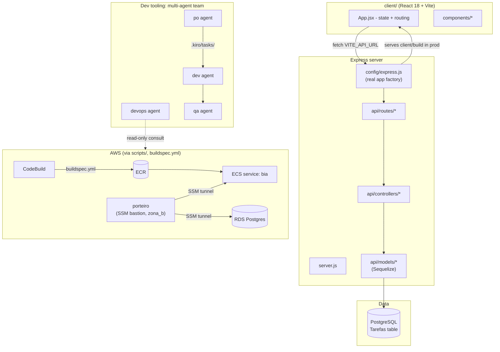
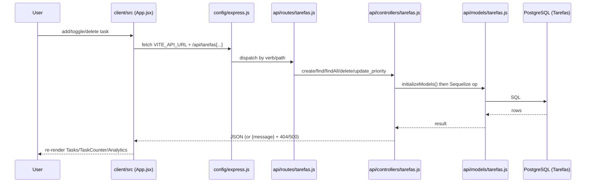
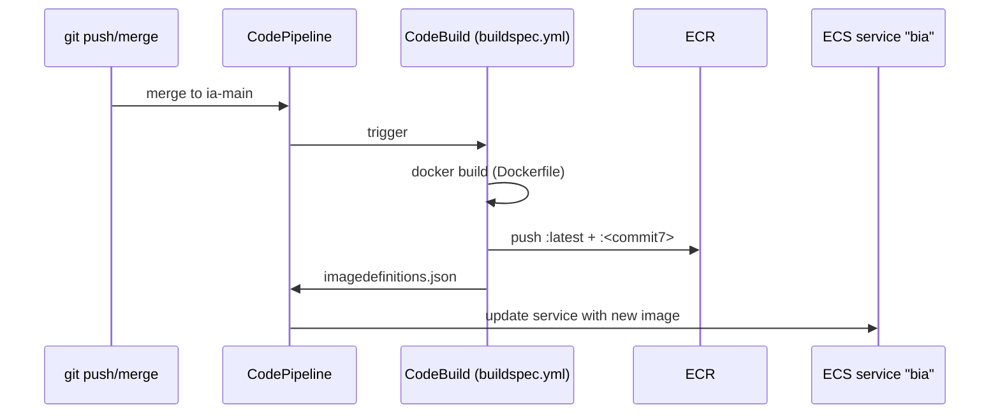
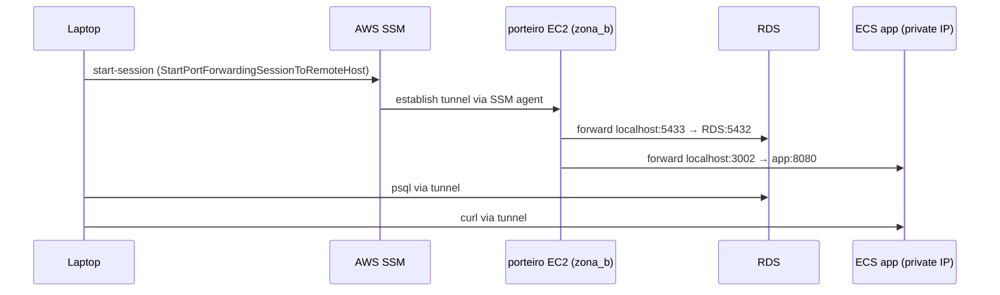

# Codebase Map

> Auto-generated by Cartographer. Last mapped: 2026-08-31T20:00:26Z

## System Overview

BIA ("Backend de Integração AWS") is a task-tracker teaching project: an Express/Postgres API with a React/Vite frontend, deployed to AWS ECS via CodePipeline/CodeBuild. The repo also hosts the tooling used to *develop* it — a multi-agent Claude Code / Kiro CLI team (po/dev/devops/qa) working through git-worktree-isolated tasks — and a large `docs/` folder of AWS-learning notes written from a data-science-background perspective.



**Legacy/dead code flagged during mapping** (see Gotchas): `index.js` + `lib/boot.js` (unused Express-generator scaffold — `app/controllers` doesn't exist), `api/routes/ping.js` (never mounted), root `index.html` ("Hello World" leftover, not the real Vite entry), `client/src/components/About.js` and `Button.jsx` (unused duplicates/legacy).

## Directory Structure

```
bia/
├── api/                    # Express layer: routes → controllers → models (Sequelize)
├── client/                 # React 18 + Vite frontend
├── config/                 # express.js (app factory), database.js, default.json
├── database/migrations/    # Sequelize migrations
├── lib/, index.js          # LEGACY unused boot scaffold — dead code
├── tests/unit/controllers/ # Jest unit tests (tarefas, versao — mocked models)
├── scripts/                # AWS infra automation (EC2/ECS lifecycle, tunnels, setup)
│   └── ecs/{unix,windows}/ # manual ECS build/deploy templates for students
├── scripts_evento/         # stub — content moved to scripts/ecs
├── docs/                   # architecture + AWS-learning notes + agent-workflow docs
│   └── architecture/       # HTML diagrams (one stale, one current — see docs map below)
├── .kiro/                  # Kiro CLI agent configs, rules, task lifecycle files
│   ├── agents/{po,dev,devops,qa}/  # per-role instruction docs (source of truth)
│   ├── rules/               # dockerfile.md, infraestrutura.md, pipeline.md
│   ├── docs/                # worktree workflow deep-dives
│   └── tasks/{doing,done}/  # task files, sequencial.md counter
├── .claude/agents/          # Claude Code subagent shells (po/dev/devops/qa)
├── .remember/                # runtime state for the "remember" plugin (logs/tmp)
├── .github/workflows/        # CI: testes-pr.yml (Jest on PRs to ia-main)
├── buildspec.yml             # CodeBuild: image build → ECR push → imagedefinitions.json
├── deploy-ecs.sh              # manual full ECS deploy/rollback tool
├── deploy-bia.sh + extrair_config_deploy.sh  # frontend-only S3 static deploy
├── Dockerfile                 # single-stage, Node 22-slim
├── compose.yml                # local server + Postgres 17.1
└── rodar_app_local_unix.sh / .bat  # one-shot local dev bootstrap
```

## Module Guide

### Backend (Express API)

**Purpose**: REST API for the "tarefas" (tasks) resource, backed by Postgres/Sequelize.
**Real entry point**: `server.js` → `config/express.js` (factory) — **not** `index.js` (dead legacy code, see Gotchas).

| File | Purpose |
|------|---------|
| `server.js` | `npm start` target: builds app from `config/express.js`, `app.listen(port)` |
| `config/express.js` | App factory: static-serves `client/build`, CORS, JSON parsing, mounts routes, SPA fallback |
| `config/database.js` | Sequelize config; local vs. remote (SSL) detection; optional AWS Secrets Manager fetch via `DB_SECRET_NAME` |
| `config/default.json` | `{ server: { port: 8080 } }`, overridable via `PORT` |
| `api/routes/tarefas.js` | `GET/POST /api/tarefas`, `GET/PUT/DELETE /api/tarefas/:uuid`, `PUT .../update_priority/:uuid` |
| `api/routes/versao.js` | `GET /api/versao` — also the Docker/Compose healthcheck target |
| `api/routes/ping.js` | **Dead code** — defines `/api/ping`, never mounted in `config/express.js` |
| `api/controllers/tarefas.js` | CRUD logic; re-initializes Sequelize models every call (no pooling reuse) |
| `api/controllers/versao.js` | Returns `"Bia ${VERSAO_API || "4.2.0"}"` |
| `api/models/index.js` | `initializeModels()` — dynamically loads every model file, wires associations |
| `api/models/tarefas.js` | `Tarefas` model: `uuid` (PK), `titulo`, `dia_atividade` (string, not DATE type!), `importante` (bool) |
| `database/migrations/...criar-tarefas.js` | Creates the `Tarefas` table matching the model |

**Dependents**: `client/src/App.jsx` (all fetch calls), `compose.yml` healthcheck, `tests/unit/controllers/*`.

**Gotchas**:
- `index.js` + `lib/boot.js`: legacy Express-generator scaffold that scans a non-existent `app/controllers/` dir — would crash if run; not referenced by any npm script. Treat as dead code.
- `api/routes/ping.js` unused/unmounted.
- `update_priority` accepts the **entire request body** (no field whitelisting) — a client could overwrite `titulo`/`dia_atividade` via that endpoint.
- `.sequelizerc`'s `models-path` points to `app/models` (doesn't exist); only migrations work correctly via CLI, not model generation.
- `api/data/tarefas.json` is unused fixture data (leftover from the original scaffold, mirrors `client/db.json`).

### Frontend (`client/` — React 18 + Vite)

**Purpose**: SPA for managing tasks; built to `client/build` and served by Express in production.
**Entry point**: `client/index.html` → `client/src/main.jsx` → `App.jsx`.

| Area | Key files |
|------|-----------|
| Boot/shell | `main.jsx`, `App.jsx` (owns all task CRUD state + `apiUrl` from `VITE_API_URL`), `ThemeContext.jsx`, `LogContext.jsx` |
| Task UI | `AddTask.jsx`, `Tasks.jsx` (paginated), `Task.jsx`, `TaskCounter.jsx`, `Modal.jsx` |
| Other pages | `Version.jsx` (`/versao`), `Analytics.jsx` (`/analytics`, recharts), `About.jsx` (`/about`) |
| Layout | `Header.jsx` (+ `VersionInfo.jsx` widget), `Footer.jsx` |
| UI kit | `components/ui/card.jsx` (used), `components/ui/chart.jsx` (**unused**, shadcn scaffold) |
| Debug | `DebugLogs.jsx` (gated by `VITE_DEBUG_MODE`) |

**Exports/API surface**: `apiUrl` resolved from `import.meta.env.VITE_API_URL`, fallback `http://localhost:8080`. All calls logged via `LogContext`.

**Dependents**: none (leaf) — consumes the backend.

**Gotchas**:
- `About.js` (unstyled, unused) vs `About.jsx` (real, imported) — dead duplicate.
- `Button.jsx` — no imports found anywhere; legacy/unused.
- `Version.jsx` and `VersionInfo.jsx` **independently** poll `/api/versao` (separate `AbortController`s) — both mounted simultaneously (Header always renders `VersionInfo`), so two polling loops run concurrently on `/versao`.
- Task completion (`concluida`) is **client-state only** — never sent to/read from the API; resets on reload. Not a DB field.
- Two parallel theming systems coexist in `index.css`: Tailwind CSS vars (shadcn-style) and a hand-rolled `--bg-primary`/`--text-primary` set, both switched by the same `[data-theme]` attribute.
- Root-level `index.html` (repo root, not `client/`) is an unrelated "Hello World" leftover — don't confuse with the real Vite entry at `client/index.html`.

### Infra & Deploy (`scripts/`, root deploy scripts, `buildspec.yml`)

**Purpose**: Provision/manage the AWS teaching environment (EC2 dev box, "porteiro" bastion, ECS pipeline) and deploy the app.

**Deploy pipeline** (automatic path):
1. Push/merge → CodePipeline triggers CodeBuild (`buildspec.yml`)
2. `buildspec.yml`: ECR login → `docker build` → tag `latest` + short commit hash → push → emit `imagedefinitions.json`
3. CodePipeline's ECS deploy action updates the service (`cluster-bia`/`service-bia`, container name `bia`)

**Manual paths**: `deploy-ecs.sh` (full build/push/register-task-def/rollback tool) and `scripts/ecs/{unix,windows}/build+deploy` (simpler, placeholder-based student templates). `deploy-bia.sh` + `extrair_config_deploy.sh` handle the **frontend only** — build client, `aws s3 sync --delete` to a static-website bucket, independent of the ECS pipeline.

**Infra vocabulary**:
- `zona_a` / `zona_b` = AWS AZs `us-east-1a`/`us-east-1b`, used as script-name suffixes.
- **`porteiro`** ("doorman") = a small EC2 bastion in `zona_b` running no app — exists purely so SSM port-forwarding (`AWS-StartPortForwardingSessionToRemoteHost`) can tunnel a laptop to the private RDS instance and to the ECS app's private IP, avoiding public exposure of RDS/SSH key management. Lifecycle: `lancar_porteiro_zona_b.sh` → `tunel_rds.sh`/`tunel_bia.sh` → `parar_porteiro.sh`, optionally scheduled via `agendar_porteiro.sh` (EventBridge) or `agendar_ec2_crontab.sh` (local cron). State tracked in `.porteiro_instance_id`.
- `bia-dev` = separate EC2 dev/teaching instance (Docker pre-installed via `user_data_ec2_zona_a.sh`), distinct from porteiro and from the ECS-hosted app.

**Key scripts**: `criar_role_ssm.sh` (SSM IAM role, prerequisite for launch scripts), `orquestrar_desafio4.sh` (end-to-end teaching demo: bastion → RDS tunnel → insert row → app tunnel → verify → teardown, with `trap cleanup EXIT`), `generate-sts-token.sh` (root, full-featured) — duplicated by a simpler `scripts/generate-sts-token.sh`.

**Local dev**: `rodar_app_local_unix.sh`/`.bat` — `docker compose up -d database` → npm install → build client → `sequelize db:migrate` → `npm start`. Or `scripts/ligar_bia_local.sh`/`parar_bia_local.sh` to start/stop the `bia-dev` EC2 box itself.

**Tests**: Jest 27.5.1, `npm test` → `jest tests/unit`. Only `tarefas` and `versao` controllers covered, fully mocked (no DB), no integration/e2e/React tests.

**Gotchas**: hardcoded AWS account ID/region in `buildspec.yml`; `deploy-bia.sh`'s `aws s3 sync --delete` is destructive to the bucket; two versions of `generate-sts-token.sh` (root vs `scripts/`); `scripts/ecs/{unix,windows}` build/deploy scripts are unfilled templates (`[SEU_CLUSTER]` placeholders); `testar-latencia.sh` uses `gdate` (macOS/Homebrew), fails on plain Linux; inconsistent Docker/Node versions across setup scripts (Node 14 vs 21, Compose v1 vs v2 plugin).

### Project Management & Multi-Agent Tooling (`.claude/`, `.kiro/`)

**Purpose**: Defines and drives the po/dev/devops/qa agent team and the task/worktree lifecycle used to develop bia itself.

**Two parallel agent-config layers**, introduced together and kept in sync:
- `.claude/agents/{po,dev,devops,qa}.md` — Claude Code native subagent shells (frontmatter: `tools`, `model: sonnet`). Each explicitly requires reading its `.kiro/agents/<role>/instrucoes.md` counterpart as the **mandatory source of truth**.
- `.kiro/agents/{po,dev,devops,qa}.json` — Kiro CLI's own agent schema, with **hard-enforced** tool/path restrictions (`toolsSettings.write.allowedPaths`, `denyByDefault`) that `.claude/agents/*.md` can only state in prose (Claude Code's `tools:` field is all-or-nothing per category, not path-scoped — see `docs/migrar-time-agentes-para-claude-code.md` gap analysis).
- `.kiro/agents/bia.json` — legacy single catch-all agent (`tools: ["*"]`), superseded by the 4-role split.
- `.kiro/agents/shared/` — empty placeholder directory.

**Role split** (one line each): **PO** owns the backlog — writes/prioritizes tasks, manages worktree bookkeeping, is the sole role that closes tasks and opens PRs. **Dev** — full-stack implementer, always rebuilds/validates the container before handoff. **DevOps** — read-only AWS/infra consultant, never mutates infra or app code. **QA** — end-to-end validator via Playwright/health checks against acceptance criteria, no code changes.

**Task lifecycle**: `.kiro/tasks/` (new) → `doing/` (in progress, one git worktree per task) → `done/` (merged, worktree removed). Naming: `[NNN]-[tipo]-[resumo].md`, counter in `.kiro/tasks/sequencial.md` (currently `002`). Every task gets its own branch off `ia-main` in `.kiro/worktrees/NNN-.../` (gitignored). Full spec lives in `.kiro/agents/po/especificacao.md`; the same procedure is intentionally repeated across `.kiro/docs/worktree-steering.md`, `worktree-workflow.md`, and `task-template-with-worktree.md` (steering/onboarding/template variants of the same content).

**Rules** (`.kiro/rules/`): `dockerfile.md` (single-stage only, simplicity-first, never overwrite existing Dockerfile), `infraestrutura.md` (ECS-on-EC2, t3.micro, strict naming conventions, no Secrets Manager/Multi-AZ — "too advanced" for the course), `pipeline.md` (CodePipeline + CodeBuild + ECS).

**`_legado-henrylle/`**: 6 pre-fork task files by the original repo owner (Henrylle Maia), archived 2026-08-31 specifically to reset `sequencial.md` to `001` for this fork — kept only as format-evolution reference, unrelated to this fork's own task cycle.

**Active runtime**: Claude Code is the current primary system (this session included); `.kiro/` JSON+instructions are retained as the shared knowledge base underneath the `.claude/` shell — a migration-in-progress, not a completed cutover (root `README.md` still describes the team as "kiro-cli" and shows a stale example task tree).

**Gotchas**: `.claude/settings.local.json` enables `aws-mcp` project-wide (`enableAllProjectMcpServers: true`) — fairly permissive default; `.kiro/mcp-db.json`/`mcp-ecs.json` look like unwired reference snippets, not active config.

### Documentation (`docs/`)

Two tracks plus a navigation index (`docs/README.md`, itself slightly stale — missing links to `aws_cli_conhecimento.md` and the newer architecture HTML):

**AWS/infra learning journey** (chronological "Dia 3 → Dia 4"): `analise-arquitetura-projeto.md` (architecture overview for a DS-background reader) → `dia-3-integracao-completa-explicada.md` (3 real integration bugs, didactic) → `aws_cli_conhecimento.md` (721-line running CLI notebook, §14 duplicates Day-3 content raw) → `desafio-4-porteiro-rds-orientacao.md` (pre-challenge orientation) → `dia-4-porteiro-tunel-ssm-tutorial.md` (executed bastion/RDS tunnel tutorial with troubleshooting log).

**Architecture diagrams** (`docs/architecture/`): `aws-ecs-diagram.html` is **stale/superseded** — depicts a production-grade design (NAT Gateways, Multi-AZ RDS, private subnets) that contradicts the project's actual simplicity-first `infraestrutura.md` rule. `aws-ecs-cenarios-evolutivos.html` explicitly supersedes it, documenting the real `bia-dev` sandbox state plus 3 evolutionary ECS scenarios grounded in the actual rules.

**Claude Code / Kiro agent-workflow track** (chronological): `panorama-agentes-e-worktrees.md` (baseline: Kiro-era team + worktrees) → `migrar-time-agentes-para-claude-code.md` (migration how-to) → `roteiro-pratico-agentes-claude-code.md` (9-module guided practice, corrects the Amazon Q→Kiro rename and notes `/agents` wizard removal) → `paralelo-kiro-cli-vs-claude-code.md` (reflective comparison + a real infra bug found: each worktree gets its own Compose DB volume, so a fresh worktree DB lacks migrations).

## Data Flow

### "Tarefas" (tasks) CRUD — end to end



Note: `concluida` (done/not-done) is added client-side only in `App.jsx`'s `getTasks()` — never persisted.

### Deploy pipeline (backend)



### Porteiro bastion tunnel (AWS learning exercise)



## Conventions

- **Backend**: factory-function controllers/routes (`() => controller`), async handlers with try/catch → `next(err)` or `{message}` + status code.
- **Infra scripts**: `[OK]`/`[ERRO]` prefixed status lines; colored `log_info/success/warning/error` bash helpers in the larger deploy scripts; unix `.sh` + windows `.bat` pairs kept in parallel for most infra scripts.
- **Task files**: emoji-headed sections (`🔧 Configuração Inicial`, `✅ Critérios de Aceitação`, `🎯 CHECKLIST DE IMPLEMENTAÇÃO`...), Portuguese throughout, `[NNN]-[tipo]-[resumo].md` naming.
- **Docs**: data-science analogy bridges before infra mechanism (matches the project's target audience), numbered "Dia N"/"Desafio N" course-day tags for chronology.
- **Agent configs**: `.claude/agents/*.md` always defers to `.kiro/agents/<role>/instrucoes.md` as the authoritative instruction source — treat the `.claude` file as a thin shell, not the full spec.

## Gotchas

- **Dead code**: `index.js` + `lib/boot.js` (references non-existent `app/controllers`), `api/routes/ping.js` (unmounted), root `index.html` ("Hello World" stub — don't confuse with `client/index.html`), `client/src/components/About.js` and `Button.jsx`, `client/src/components/ui/chart.jsx` (shadcn scaffold, unused).
- **No field whitelisting** on `PUT /api/tarefas/update_priority/:uuid` — accepts full request body.
- **`concluida` (task-done state) is not persisted** — client-only, resets on reload.
- **`.sequelizerc` `models-path` mismatch** (`app/models` vs actual `api/models`) — only migrations work via CLI.
- **Two duplicate `generate-sts-token.sh`** (root, full-featured vs `scripts/`, simpler).
- **`docs/architecture/aws-ecs-diagram.html` is stale** — contradicts the project's actual simplicity-first infra rule; use `aws-ecs-cenarios-evolutivos.html` instead.
- **`docs/README.md` index is incomplete** — missing links to `aws_cli_conhecimento.md` and the newer architecture HTML.
- **Per-worktree DB isolation bug** (found by QA on task 001, documented in `docs/paralelo-kiro-cli-vs-claude-code.md`): each git worktree gets its own Docker Compose Postgres volume, so a fresh worktree's DB lacks migrations unless `sequelize db:migrate` is run inside it.
- **Claude Code `PreToolUse` hooks are tool-scoped, not agent-scoped** — Kiro's per-agent path/write restrictions (`toolsSettings.write.allowedPaths`) cannot be cleanly replicated as hard enforcement in Claude Code; `.claude/agents/*.md` restrictions are prose-only, not enforced.
- **RDS tunnel port conflicts**: a local Docker `my-postgres` container can silently steal port 5433, causing `tunel_rds.sh` to connect to the wrong DB (documented incident in `docs/dia-4-porteiro-tunel-ssm-tutorial.md`).
- **No Elastic IP** on the `bia-dev`/porteiro EC2 instances — IP can change on restart, silently breaking any build-time-baked frontend API URL.

## Navigation Guide

**To add/modify a task API endpoint**: `api/routes/tarefas.js` → `api/controllers/tarefas.js` → (if schema changes) `api/models/tarefas.js` + new migration in `database/migrations/`.

**To add a new React component/page**: create in `client/src/components/`, wire route in `App.jsx`, reuse `client/src/lib/utils.js`'s `cn()` for styling, follow the existing `components/ui/card.jsx` shadcn pattern for primitives.

**To change how the app connects to Postgres**: `config/database.js` (local/remote detection, Secrets Manager integration) — check `compose.yml` env vars for local, `.kiro/rules/infraestrutura.md` for what's in/out of scope for the sandbox.

**To modify the deploy pipeline**: `buildspec.yml` (CodeBuild step) and/or `deploy-ecs.sh` (manual path); check `.kiro/rules/pipeline.md` and `.kiro/rules/dockerfile.md` first (simplicity-first constraints — don't add multi-stage builds, non-root users, etc.).

**To add/modify infra automation**: `scripts/` — follow the existing unix/`.sh` + windows/`.bat` pairing convention; check `docs/architecture/aws-ecs-cenarios-evolutivos.html` for which scenario (no-ALB / ALB / ALB+cache) a change targets.

**To create or work a task in the agent workflow**: read `docs/panorama-agentes-e-worktrees.md` first, then `.kiro/agents/po/especificacao.md` (task/worktree spec) before touching `.kiro/tasks/`. Agents should always read their own `.kiro/agents/<role>/instrucoes.md` (mandatory per `.claude/agents/<role>.md`).

**To update agent definitions**: keep `.claude/agents/*.md` and `.kiro/agents/*.json`/`instrucoes.md` in sync — the `.claude` file is a thin pointer, the `.kiro` files are the enforced/authoritative source.
