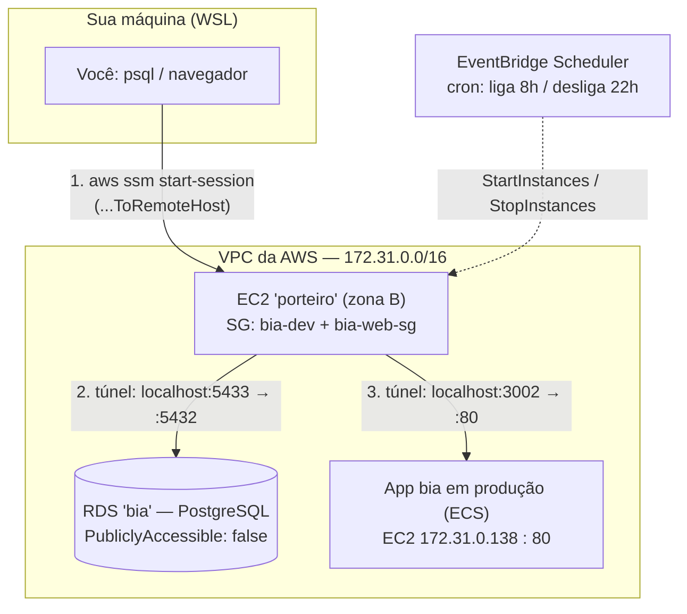

# 🚪🔌 Dia 4 — Porteiro + Túneis SSM (RDS e bia) + Rotina automática, para quem vem de Dados

> **Sobre este documento:** feito pra estudar **sem precisar assistir a aula inteira agora**. Traz os 4 pontos da imagem "Dia 4 — Parte 1" que ainda faltavam (túnel pra máquina da bia, túnel pro RDS, e a rotina automática de ligar/desligar o porteiro — a leitura do `lancar_ec2_zona_a.sh` já está na [seção 15 do aws_cli_conhecimento.md](./aws_cli_conhecimento.md#15-day-4-parte-1--tela-preta-zipunzip-tail--f-command-substitution-e-a-leitura-do-lancar_ec2_zona_ash)), com os scripts já implementados e prontos em `scripts/`, mais uma ponte explícita entre o mundo de Ciência de Dados e o mundo de DevOps/infra, que é onde normalmente trava quem vem do seu perfil.
> Aprofunda o que já estava esboçado em [`desafio-4-porteiro-rds-orientacao.md`](./desafio-4-porteiro-rds-orientacao.md) — aqui os dados da conta (IPs, IDs, portas) foram conferidos ao vivo na AWS antes de escrever, e os scripts já existem de verdade, não é só roteiro.

---

## 0. Por que esse assunto parece "menos Ciência de Dados" — e por que não é bem assim

A sensação de "isso aqui é mundo de engenheiro de software/DevOps, não o meu" é normal e tem uma causa concreta: **como cientista de dados, você tipicamente trabalha "de dentro" de um ambiente já pronto** — um notebook, um cluster gerenciado, um banco que você já tem acesso. Alguém (uma equipe de infra) já resolveu "como chegar até os dados" antes de você abrir o Jupyter.

O que essas semanas de AWS estão ensinando é exatamente **o que tem por trás dessa porta que sempre esteve aberta pra você**. Não é uma habilidade nova e paralela à sua — é o andar de baixo do mesmo prédio.

| Conceito de hoje | Onde você já viu isso, sem essa camada exposta |
|---|---|
| RDS com `PubliclyAccessible: false` | Um data warehouse corporativo que só aceita conexão vinda da VPN da empresa — você nunca "criou" essa regra, só sofreu com ela quando esqueceu de ligar a VPN |
| Bastion host / "porteiro" | O mesmo papel de uma VPN, ou de um servidor de "jump" que o time de TI te dava acesso — você entrava nele antes de chegar no banco de verdade |
| Ligar/desligar recurso pra economizar | Uma instância do **SageMaker Notebook parada quando ninguém está usando** — mesmíssimo princípio: cobra por hora ligada, e alguém (você, agora) é responsável por não deixar rodando à toa |
| Túnel SSM | Um túnel SSH que talvez você já tenha usado sem saber o nome, pra acessar um Jupyter remoto num cluster que não tem IP público |

A diferença real é que, até aqui, **você era o consumidor** dessas peças. Agora está aprendendo a **construir e operar** a peça — e isso é, de fato, mais próximo de DevOps/infra do que de modelagem. Não tem problema sentir que é "outro músculo": é mesmo. Mas ele sustenta o seu trabalho de sempre, não substitui.

---

## 1. Os 3 conceitos que faltam pra fazer sentido

### 1.1 Bastion host (o "porteiro")

**O que é:** uma instância EC2 descartável, sem aplicação nenhuma rodando dentro, cuja única função é servir de ponte pra você alcançar algo que é **intencionalmente inacessível de fora** — nesse caso, o RDS.

**Por que o RDS precisa disso:** confirmado ao vivo na conta:
```
RDS "bia" (PostgreSQL)
  Endpoint: bia.csl22kw6cnmi.us-east-1.rds.amazonaws.com:5432
  PubliclyAccessible: false
  Security Group bia-db: só aceita porta 5432 vindo de quem estiver no SG "bia-web-sg"
```
Não é sobre senha — mesmo com usuário/senha corretos, `psql` do seu notebook **nunca vai conseguir nem abrir a conexão TCP**, porque não existe rota de rede até lá. O porteiro existe só pra abrir essa rota, temporariamente.

### 1.2 Túnel SSM Port Forwarding (dois sabores)

SSM Port Forwarding redireciona uma porta da sua máquina local pra dentro da rede privada da AWS — **sem SSH, sem chave, sem porta pública aberta**. A autenticação é via IAM (a mesma identidade que já usa pra rodar `aws` comandos).

| Documento SSM | Túnel vai até... | Usado em qual túnel aqui |
|---|---|---|
| `AWS-StartPortForwardingSession` | A **própria** instância que você conectou | Não é o caso hoje |
| `AWS-StartPortForwardingSessionToRemoteHost` | **Outra máquina**, que só a instância conectada alcança | Túnel pro RDS e túnel pra bia — o porteiro é só passagem |

```
Sua máquina (WSL)              Porteiro (EC2, VPC)          Destino final
─────────────────              ────────────────────          ─────────────
localhost:5433  ── túnel SSM ──▶ (só de passagem) ──────────▶ RDS :5432
localhost:3002  ── túnel SSM ──▶ (só de passagem) ──────────▶ app bia :80
```
O número da porta local (5433, 3002) é só uma etiqueta sua — não precisa bater com a porta remota real. (Se a 5433 estiver ocupada na sua máquina, use outra — ver seção 6.)

### 1.3 EventBridge Scheduler (o "crontab gerenciado pela AWS")

Pra ligar/desligar o porteiro sozinho, sem depender do seu notebook estar aberto no horário certo, a peça é o **Amazon EventBridge Scheduler** — um agendador totalmente gerenciado que, no horário definido (expressão `cron`, sempre em UTC), chama diretamente uma API da AWS. Aqui, chama `StartInstances`/`StopInstances` do EC2 — sem precisar de Lambda no meio.

Pense nele como "um crontab que roda dentro da própria AWS, não na sua máquina" — a vantagem é que ele funciona mesmo com seu WSL fechado.

### 1.4 Duas formas de automatizar liga/desliga — e quando usar cada uma

O exercício "automação pra ligar e desligar EC2 usando Shell Script e AWS CLI" pode ser resolvido de dois jeitos válidos, com trade-off oposto:

| | `crontab` local + Shell Script | EventBridge Scheduler |
|---|---|---|
| Onde a "lógica de horário" mora | No seu WSL (`crontab -l`) | Dentro da AWS |
| Precisa do notebook ligado no horário? | **Sim** | Não |
| O que dispara a ação | `cron` chama `aws ec2 start/stop-instances` | A própria AWS chama a API do EC2 diretamente |
| Onde ficam os logs | Arquivo local (`scripts/ec2_agendamento.log`) | CloudWatch (se configurado) |
| Scripts deste repo | `agendar_ec2_crontab.sh` / `remover_agendamento_ec2_crontab.sh` | `agendar_porteiro.sh` |

Nenhum dos dois é "o errado" — `crontab` é a resposta mais literal ao enunciado do curso (Shell Script + AWS CLI, sem nenhum outro serviço da AWS envolvido no agendamento em si); EventBridge é a resposta mais robusta pra um cenário real, onde ninguém quer depender do próprio notebook estar ligado às 8h da manhã.

---

## 2. Diagrama do fluxo completo



Salve esse bloco no Obsidian como está — Mermaid renderiza nativamente lá.

---

## 3. Prompt pronto pra gerar uma imagem explicativa

Se quiser uma versão ilustrada (pra colar num slide, Notion, etc), use este prompt em qualquer gerador de imagem (DALL-E, Midjourney, Nano Banana...):

> Ilustração técnica em estilo flat/isométrico, fundo branco ou cinza muito claro, paleta de cores AWS (laranja #FF9900, azul-marinho #232F3E, cinza claro). No centro da imagem, um retângulo grande e tracejado rotulado "VPC AWS", representando uma rede privada. Dentro dele, à esquerda, um pequeno personagem estilo "porteiro/segurança" com uniforme laranja, parado ao lado de um ícone de porta giratória, rotulado "EC2 Porteiro (bastion host)". Fora do retângulo, à esquerda da cena, um notebook com tela azul representando "sua máquina local (WSL)". Duas linhas tracejadas coloridas saem do notebook, atravessam a borda da VPC e chegam até o porteiro, representando túneis. Do porteiro, a linha azul continua até um cilindro de banco de dados rotulado "RDS PostgreSQL" com um pequeno cadeado fechado ao lado (representando "sem acesso público"). A linha verde continua do porteiro até uma caixa de contêiner rotulada "App bia (produção)". Acima do porteiro, um ícone de relógio com setas circulares (agendamento), conectado por uma linha pontilhada cinza, com o texto "liga 8h / desliga 22h — EventBridge Scheduler". Estilo de infográfico educacional, linhas limpas, sem gradientes pesados, texto pequeno e legível em português nos rótulos de cada elemento.

**Resultado gerado com esse prompt:**


*(arquivo `porteiro_aws.png`, na raiz do repositório)*

> ⚠️ **Correção de rótulo:** a imagem saiu com "TÚNEL SSH" nas duas linhas — é um erro do gerador de imagem, não seu. Como explicado na seção 1.2, o mecanismo real é **SSM Port Forwarding**, autenticado por IAM, sem chave SSH nenhuma envolvida. Leia "TÚNEL SSH" como "túnel SSM" mentalmente (ou edite a imagem depois, se for usá-la fora daqui).

---

## 4. Roteiro passo a passo — o que foi feito, e por quê

> ✅ **Status:** executado de ponta a ponta em 28/08/2026, com sucesso confirmado (registro inserido na mão apareceu na API de produção). Esse roteiro já reflete o caminho **correto e definitivo** — os dois problemas de ambiente que apareceram na primeira tentativa (senha do RDS errada, banco/tabela inexistentes) já foram corrigidos de forma permanente e não se repetem mais. Se você mesmo tropeçar em algo parecido revisitando isso mais tarde, é a seção 6 (Troubleshooting) que explica o que fazer.

Todos os comandos rodam no terminal local (WSL), dentro de `~/Workdir/AWS/bia`. Os scripts já existem em `scripts/` — veja a seção 5.

> 🚀 **Atalho:** os passos 1 a 8 abaixo (tudo, exceto a automação opcional do Passo 9) também rodam de uma vez só com `./scripts/orquestrar_desafio4.sh` — ele reaproveita um porteiro existente se houver, abre e fecha os túneis sozinho em segundo plano, e grava tudo num log com timestamp em `logs/`. Bom pra gerar um material único de print/documentação sem repetir os passos manualmente toda vez. O passo a passo abaixo continua valendo pra quem quer entender ou rodar cada peça isoladamente.

**Passo 1 — Lançar o porteiro**
```bash
./scripts/lancar_porteiro_zona_b.sh
```
*Por quê:* o RDS é `PubliclyAccessible: false` — não existe rota de rede até ele a partir do seu notebook. O porteiro é uma EC2 descartável dentro da VPC, cuja única função é servir de ponte. Ele nasce com os **dois** Security Groups necessários (`bia-dev` + `bia-web-sg`), porque o SG do RDS só aceita conexão vinda de quem estiver no `bia-web-sg`. O ID da instância criada fica salvo em `.porteiro_instance_id` (arquivo local, ignorado pelo git) — os próximos scripts leem esse arquivo sozinhos.

**Passo 2 — Confirmar que o SSM já enxerga o porteiro**
```bash
aws ssm describe-instance-information --region us-east-1 \
  --filters "Key=InstanceIds,Values=$(cat .porteiro_instance_id)"
```
*Por quê:* o agente SSM demora alguns segundos a mais que o "running" da EC2 pra se registrar. Repita até `"PingStatus": "Online"` — tentar o túnel antes disso dá erro de "target not connected".

**Passo 3 — Abrir o túnel pro RDS (terminal A, fica ocupado)**
```bash
./scripts/tunel_rds.sh
```
*Por quê:* usa `AWS-StartPortForwardingSessionToRemoteHost` — o destino final (RDS) não é o porteiro em si, é *outra máquina* que só o porteiro alcança. Mapeia `localhost:5433 → RDS:5432`, a porta local pedida no enunciado (se ela estiver ocupada na sua máquina, `LOCAL_PORT=5434 ./scripts/tunel_rds.sh` sobrescreve sem editar o script).

**Passo 4 — Recuperar as credenciais reais (terminal B, novo)**
```bash
aws ecs describe-task-definition --task-definition task-def-bia \
  --query "taskDefinition.containerDefinitions[0].environment"
```
*Por quê:* a senha não fica fixada em nenhum script commitado, por boa prática — ela é lida direto da task definition do ECS toda vez que for necessária.

**Passo 5 — Inserir 1 registro manualmente, direto no banco**
```bash
PGPASSWORD='<senha_recuperada_no_passo_4>' psql -h localhost -p 5433 -U postgres -d bia \
  -c 'INSERT INTO "Tarefas" (titulo, dia_atividade, importante) VALUES ('"'"'Inserido manualmente via porteiro'"'"', CURRENT_DATE, false);'
```
*Por quê:* esse é o cerne pedagógico do desafio — provar que o banco é a **fonte única de verdade**, escrevendo nele por um caminho totalmente diferente do fluxo normal da API. Repare no nome da tabela entre aspas duplas, `"Tarefas"` (T maiúsculo): é assim que o Sequelize criou a tabela de verdade ([`api/models/tarefas.js`](../api/models/tarefas.js)), e o Postgres é case-sensitive pra identificadores entre aspas.

**Passo 6 — Fechar o túnel do RDS e abrir o túnel pra bia**
```bash
# Ctrl+C no terminal A pra encerrar o túnel do RDS, depois:
./scripts/tunel_bia.sh
```
*Por quê:* mesma lógica do Passo 3, agora apontando pra instância de produção da aplicação (`172.31.0.138:80`, por trás do ECS) em vez do RDS — mapeando `localhost:3002 → app bia:80`.

**Passo 7 — Confirmar na aplicação real**
```bash
curl -s http://localhost:3002/api/tarefas
```
Ou abra `http://localhost:3002` no navegador. O registro inserido na mão no Passo 5 deve aparecer na resposta — a prova visual de que API e `INSERT` direto convergem pro mesmo banco.

**Passo 8 — Encerrar tudo**
```bash
# Ctrl+C na janela do tunel_bia.sh, depois:
./scripts/parar_porteiro.sh
```
*Por quê:* o porteiro não tem motivo pra ficar ligado além do tempo de uso — é recurso descartável, cobrado por hora.

**Passo 9 (opcional) — Automatizar liga/desliga**
```bash
./scripts/agendar_porteiro.sh
```
*Por quê:* cria o agendamento gerenciado (liga 8h BRT seg-sex, desliga 22h BRT seg-sex) via EventBridge Scheduler, pra não depender de lembrar de rodar o Passo 8 manualmente todo dia.

---

## 5. Os scripts (o que cada um faz)

| Script | O que faz | Bloqueia o terminal? |
|---|---|---|
| `scripts/lancar_porteiro_zona_b.sh` | Lança a EC2 porteiro na zona B, com os 2 Security Groups certos, salva o ID em `.porteiro_instance_id` | Não |
| `scripts/tunel_rds.sh` | Abre túnel `localhost:5433 → RDS:5432` via porteiro | Sim, até `Ctrl+C` |
| `scripts/tunel_bia.sh` | Abre túnel `localhost:3002 → app bia (produção):80` via porteiro | Sim, até `Ctrl+C` |
| `scripts/parar_porteiro.sh` | Para (stop) o porteiro | Não |
| `scripts/agendar_porteiro.sh` | Cria a IAM role + os 2 agendamentos no EventBridge Scheduler pra ligar/desligar sozinho | Não |
| `scripts/ligar_ec2.sh <instance-id>` | Liga qualquer EC2 pelo ID, com checagem de estado antes de agir — genérico, não só pro porteiro | Não |
| `scripts/desligar_ec2.sh <instance-id>` | Desliga qualquer EC2 pelo ID, mesma lógica de `ligar_ec2.sh` ao contrário | Não |
| `scripts/agendar_ec2_crontab.sh <instance-id> [liga] [desliga] [dias]` | Instala 2 entradas no `crontab` local que chamam os dois scripts acima nos horários definidos — a versão "100% Shell Script + AWS CLI" do agendamento (ver seção 1.4) | Não |
| `scripts/remover_agendamento_ec2_crontab.sh <instance-id>` | Remove do `crontab` local só as entradas daquela instância | Não |
| `scripts/orquestrar_desafio4.sh` | Roda os Passos 1-8 do roteiro em sequência, sozinho, gravando log com timestamp em `logs/` | Não (só enquanto roda) |

**Como o orquestrador mata os túneis sem deixar processo pendurado:** `tunel_rds.sh` e `tunel_bia.sh` terminam com `exec aws ssm start-session ...` em vez de só `aws ssm start-session ...` — isso substitui o processo do script pelo do `aws cli` (mesmo PID), então o orquestrador consegue derrubar o túnel com um `kill` direto no PID que capturou ao colocar o script em segundo plano (`&`), sem sobrar nenhum processo `aws`/`session-manager-plugin` órfão rodando escondido.

**Diferença deliberada em relação ao `lancar_ec2_zona_a.sh` original:** o `lancar_porteiro_zona_b.sh` **checa se o `run-instances` de fato devolveu um ID** antes de seguir — o script original da imersão não faz essa checagem (ponto de atenção já registrado na [seção 15 do aws_cli_conhecimento.md](./aws_cli_conhecimento.md)). Pequena melhoria, mas mostra o hábito certo: todo passo que pode falhar silenciosamente merece uma checagem.

**Uso rápido do agendamento via crontab:**
```bash
# liga 8h, desliga 22h, seg-sex (padrão) — pro porteiro, por exemplo:
./scripts/agendar_ec2_crontab.sh $(cat .porteiro_instance_id)

# ou com horários/dias customizados:
./scripts/agendar_ec2_crontab.sh i-074bcbdb1642ec026 07:30 23:00 1-6

# conferir o que foi instalado:
crontab -l

# remover depois:
./scripts/remover_agendamento_ec2_crontab.sh i-074bcbdb1642ec026
```

---

## 6. Troubleshooting

Cada item abaixo é um problema **real** que apareceu ao rodar isso pela primeira vez (28/08/2026), no formato sintoma → causa → solução. Os dois marcados como "✅ corrigido de vez" não deveriam mais acontecer com você — ficam registrados só pra explicar por que o roteiro da seção 4 é do jeito que é, e como diagnosticar algo parecido se reaparecer.

### O túnel pro RDS trava, sem erro nenhum na tela

- **Causa:** o Security Group do RDS (`bia-db`) só aceita conexão de quem estiver no SG `bia-web-sg`. Se o porteiro não tiver esse SG anexado, o pacote é descartado silenciosamente — não é bug do script SSM, é firewall de rede fazendo o que devia.
- **Solução:** confirme que o porteiro tem os dois SGs (`aws ec2 describe-instances --instance-ids $(cat .porteiro_instance_id) --query "Reservations[0].Instances[0].SecurityGroups"`). O `lancar_porteiro_zona_b.sh` já anexa os dois corretamente — esse erro só volta se alguém editar o script pra tirar um deles.

### `password authentication failed for user "postgres"`, mesmo copiando a senha certinho

- **Causa:** teste decisivo pra isolar isso é passar a senha via `PGPASSWORD='...'` (variável de ambiente) em vez do prompt interativo — elimina qualquer suspeita de erro de digitação/cópia. Se mesmo assim falhar, e a própria aplicação de produção também falhar no mesmo teste (veja o item da API abaixo), a causa é a senha salva estar desatualizada em relação à senha real do RDS.
- **✅ Corrigido de vez (28/08/2026):** a `DB_PWD` gravada em `task-def-bia:1` não batia com a senha mestre real do RDS. Resolvido resetando a senha mestre (`aws rds modify-db-instance --master-user-password ... --apply-immediately`) e publicando uma nova revisão da task definition (`task-def-bia:2`) com a senha atualizada, seguida de `aws ecs update-service --force-new-deployment`. A senha atual não fica fixada em nenhum documento nem script de propósito — recupere sempre via `aws ecs describe-task-definition --task-definition task-def-bia --query "taskDefinition.containerDefinitions[0].environment"`.

### `FATAL: database "bia" does not exist`

- **Causa:** o banco `bia` e a tabela `"Tarefas"` nunca tinham sido provisionados de fato nessa instância RDS — só existia o banco `postgres` padrão. O app usa Sequelize com `database: "bia"` hardcoded ([`config/database.js`](../config/database.js)), e a tabela real se chama `"Tarefas"` — com T maiúsculo, entre aspas (confirmado em [`api/models/tarefas.js`](../api/models/tarefas.js) e na migration original `database/migrations/20210924000838-criar-tarefas.js`). Sem as aspas, `INSERT INTO tarefas` procura por `tarefas` minúsculo, que não existe.
- **✅ Corrigido de vez (28/08/2026):** banco e tabela recriados via SQL bruto pelo túnel, replicando a estrutura da migration oficial (esse projeto não tem `sequelize-cli` fácil de rodar de fora, por causa do `config/database.js` customizado). Não precisa repetir.

### `curl`/navegador sem resposta nenhuma na porta 3002 (ou 5433)

- **Causa:** o túnel daquela porta não está mais ativo — a janela de terminal onde ele rodava foi fechada, ou recebeu `Ctrl+C`. `AWS-StartPortForwardingSessionToRemoteHost` é uma sessão contínua, não um comando que "roda e termina": ela **precisa** ficar ocupando uma janela o tempo todo em que for usada.
- **Solução:** `curl -v` mostra "Connection refused" nesse caso (diferente de um JSON de erro da aplicação). Reabra o túnel (`./scripts/tunel_rds.sh` ou `./scripts/tunel_bia.sh`) numa janela livre e repita o teste numa segunda janela.

### `psql`: `\l` dá erro de `column d.daticulocale does not exist`

- **Causa:** incompatibilidade de versão entre o `psql` (cliente) instalado no seu WSL e o Postgres 18 do servidor — o comando `\l` do seu cliente é mais antigo e referencia uma coluna que mudou de nome nessa versão do servidor. Inofensivo, não afeta `SELECT`/`INSERT` nem nenhum outro comando SQL direto.
- **Solução:** ignore, ou liste os bancos com SQL puro em vez do atalho: `SELECT datname FROM pg_database;`.

### Porta 5433 já em uso, aparentemente sem motivo

- **Causa:** um container Docker de outro projeto seu, rodando localmente no WSL, pode já ocupar a porta 5433 (apareceu assim aqui, visível no painel "Ports" do VS Code como `docker-proxy`) — nada a ver com a AWS. Se o túnel SSM tentar usar a mesma porta local, o resultado é ambíguo: você não sabe se está falando com o RDS de verdade ou com esse Postgres local.
- **Solução:** `tunel_rds.sh` mantém 5433 como padrão (é a porta pedida no enunciado do desafio), mas aceita sobrescrever sem editar o arquivo: `LOCAL_PORT=5434 ./scripts/tunel_rds.sh`. Use isso só se a 5433 estiver mesmo ocupada na sua máquina — confira com `ss -ltnp | grep 5433` antes de assumir o conflito.

### `AccessDenied` ou comando trava rodando "de dentro" da sessão SSM

- **Causa:** a IAM Role anexada às instâncias (`role-acesso-ssm`) só tem permissão pra SSM, não pra gerenciar a conta (EC2, ECS, RDS, Scheduler...).
- **Solução:** comandos de gerenciamento de conta (`stop-instances`, `create-schedule`, `describe-task-definition`, etc) sempre rodam no **terminal local**, nunca dentro de uma sessão `aws ssm start-session` — mesmo ponto já registrado na seção 9 do [`aws_cli_conhecimento.md`](./aws_cli_conhecimento.md).

### O agendamento automático ligou/desligou na hora errada (versão EventBridge)

- **Causa:** `aws scheduler` usa expressões `cron` sempre em **UTC**, nunca no horário local.
- **Solução:** os horários já vêm convertidos dentro do `agendar_porteiro.sh` (BRT = UTC-3, com o comentário explicando a conta) — se for mudar o horário, lembre de refazer essa conversão.

### O agendamento automático não disparou nenhuma vez (versão crontab)

- **Causa mais comum:** o WSL estava desligado (ou hibernado/sem cron rodando) no horário marcado. Diferente do EventBridge, o `crontab` local só funciona com a máquina ligada — é a limitação intrínseca dessa abordagem, não um bug.
- **Segunda causa comum:** `cron` roda com um `PATH` mínimo, que às vezes não inclui `/usr/local/bin` (onde o `aws` costuma estar) — o job falha com `aws: command not found`, silenciosamente, só visível no log. `agendar_ec2_crontab.sh` já injeta uma linha `PATH=...` no crontab pra evitar isso, mas se você editar o crontab manualmente depois, cuidado pra não apagar essa linha.
- **Diagnóstico:** `cat scripts/ec2_agendamento.log` — cada execução (ou tentativa falha) fica registrada ali, com timestamp.
- **Verificação rápida de que o cron em si está rodando:** `crontab -l` mostra as entradas instaladas; `systemctl status cron` (ou `service cron status`) confirma se o serviço de cron está ativo. `cat /proc/1/comm` diz qual dos dois ambientes você está usando agora — `systemd` (partição Linux nativa) ou `init` (WSL).
- **Isso muda o comportamento de verdade:** na **partição Linux nativa**, systemd é real e o `cron.service` já sobe sozinho (`enabled` + `active`) sem nenhum passo manual — confirmado em 28/08/2026. **No WSL**, sem systemd de verdade, não há essa garantia — o mesmo problema já documentado pro Docker na seção 10 do [`aws_cli_conhecimento.md`](./aws_cli_conhecimento.md) (precisa de `systemctl enable --now <serviço>` a cada sessão) pode valer também pro `cron`. Se for rodar o agendamento a partir do WSL, vale conferir `systemctl status cron` antes de assumir que ele já está de pé.

### Dias da semana no crontab não bateram com o esperado

- **Causa:** o campo "dia da semana" do `cron` usa `0=domingo` até `6=sábado` — diferente da convenção `MON-FRI` usada nas expressões `cron(...)` do EventBridge Scheduler (que aceita nomes de dia). `agendar_ec2_crontab.sh` usa a sintaxe numérica do `cron` tradicional (padrão `1-5` = segunda a sexta).
- **Solução:** confira a sintaxe antes de customizar — `0,6` pra só fim de semana, `1-5` pra dias úteis, `*` pra todo dia.

### `orquestrar_desafio4.sh` trava em "Porta XXXX não abriu a tempo"

- **Causa mais comum:** o `.porteiro_instance_id` aponta pra uma instância que não existe mais (foi terminada manualmente, por exemplo) — o script tenta reaproveitá-la, falha silenciosamente na checagem de estado, e o túnel nunca chega a abrir porta nenhuma.
- **Solução:** apague o arquivo de estado e deixe o script lançar um porteiro novo: `rm .porteiro_instance_id && ./scripts/orquestrar_desafio4.sh`.
- **Outra causa possível:** o SSM não ficou "Online" a tempo (menos comum, mas pode acontecer com uma instância recém-lançada) — o log em `logs/` mostra em qual dos 6 passos travou.

---

## 7. Referências

- [`aws_cli_conhecimento.md`](./aws_cli_conhecimento.md) — seções 4, 8 e 9 (SSM em geral) e seção 15 (zip/unzip, tail -f, command substitution, leitura completa do `lancar_ec2_zona_a.sh`)
- [`desafio-4-porteiro-rds-orientacao.md`](./desafio-4-porteiro-rds-orientacao.md) — orientação conceitual original do desafio, escrita antes desses scripts existirem
- [`dia-3-integracao-completa-explicada.md`](./dia-3-integracao-completa-explicada.md) — por que IP privado só funciona dentro da VPC, contexto que explica por que o porteiro precisa estar *dentro* da VPC pra alcançar RDS e app
